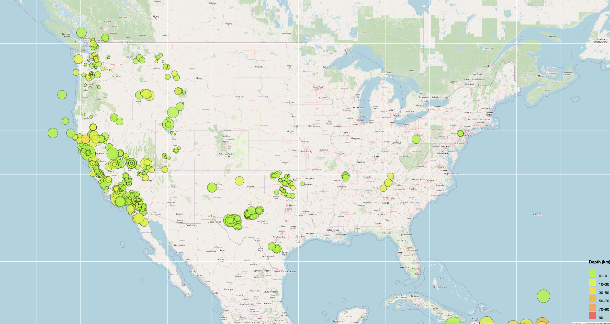
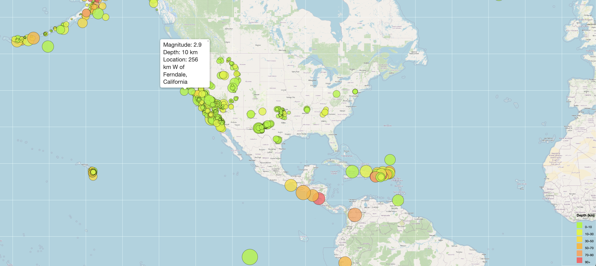

# USGS Earthquake Visualization

## Overview
This project visualizes real-time earthquake data provided by the [United States Geological Survey (USGS)](https://earthquake.usgs.gov/) using [Leaflet.js](https://leafletjs.com/). The map displays recent global earthquakes, with markers sized based on magnitude and colored based on depth. Users can interact with the map to view earthquake information, such as magnitude, depth, and location, using popups.

The project aims to offer an engaging and meaningful way to visualize seismic activity and better inform the public and organizations.

## Features
- **Interactive Map**: Displays earthquake locations globally.
- **Markers**:
  - **Size**: Proportional to the earthquake's magnitude.
  - **Color**: Reflects the earthquake's depth (shallow to deep).
- **Popups**: Display detailed earthquake information including:
  - Magnitude
  - Depth
  - Location
- **Legend**: Explains the depth-to-color mapping for easy reference.

## Getting Started

### Prerequisites
To run the project locally, you'll need:
- A web browser (Chrome, Firefox, etc.)
- Internet connection (to fetch map tiles and earthquake data)

### Installation

1. **Clone the repository**:
   ```bash
   git clone https://github.com/Rajamani-M/leaflet-challenge.git
   ```

2. **Navigate to the project directory**:
   ```bash
   cd leaflet-challenge
   ```

3. **Run the project**:
   Open the `index.html` file in your browser by double-clicking it or dragging it into your browser window.

## Data Source
The earthquake data is fetched from the USGS GeoJSON Feed, which is updated every 5 minutes. The current project uses the **"All Earthquakes from the Past 7 Days"** dataset. You can explore other datasets at the [USGS GeoJSON feed page](https://earthquake.usgs.gov/earthquakes/feed/v1.0/geojson.php).

If you want to use a different dataset, update the `link` variable in `logic.js`:

```javascript
let link = "https://earthquake.usgs.gov/earthquakes/feed/v1.0/summary/all_week.geojson";
```

## Project Structure

```
/leaflet-challenge
├── index.html              # Main HTML file for the webpage
├── static/
│   ├── css/
│   │   └── style.css       # Custom CSS for the project
│   └── js/
│       └── logic.js        # Main JavaScript logic for map and data handling
├── README.md               # This file
└── .gitignore              # Git ignore file
```

### Explanation of Files:
- `index.html`: Contains the structure of the webpage and links to Leaflet, D3.js, and custom styles/scripts.
- `style.css`: Custom CSS to style the map and webpage elements.
- `logic.js`: Contains JavaScript logic for fetching data, plotting markers, adding popups, and creating the legend.

## Customization

### Changing the Map Center
To change the initial view of the map (center and zoom level), update the following code in `logic.js`:

```javascript
let myMap = L.map("map", {
  center: [37.09, -95.71],  // Coordinates for the map center
  zoom: 5                   // Initial zoom level
});
```

### Adjusting Marker Size
You can adjust the size of the earthquake markers by changing the multiplier in the `markerSize()` function:

```javascript
function markerSize(magnitude) {
  return magnitude * 10;  // Change the multiplier to increase or decrease marker size
}
```

### Modifying Marker Colors
The color of the earthquake markers is based on depth. You can change the color scheme by updating the `getColor()` function:

```javascript
function getColor(depth) {
  return depth > 90 ? '#ff5f65' :  // Deep earthquakes
         depth > 70 ? '#fca45d' :
         depth > 50 ? '#fdb72a' :
         depth > 30 ? '#f7db11' :
         depth > 10 ? '#dcf401' :  // Shallow earthquakes
                      '#a3f603';   // Very shallow
}
```

## Visualization Details

- **Map Legend**: Located in the bottom right, showing the depth intervals and corresponding colors.
- **Popups**: Click on any marker to view the earthquake's magnitude, depth, and location.

### Screenshots
Here are example screenshots of the project:

1. **Interactive Map**:
    


2. **Popup Information**:
    


## Future Enhancements
- **Part 2 (Optional)**: Add tectonic plates data to visualize the relationship between plate boundaries and seismic activity.
- **Additional Base Maps**: Offer options to switch between different map styles (e.g., satellite, terrain).
- **Layer Controls**: Implement layers to toggle earthquake and tectonic plates data.

## Conclusion
This project offers a clear and interactive visualization of global earthquake data. With room for future additions like tectonic plate overlays and more base maps, it can evolve into a more comprehensive seismic data visualization tool.